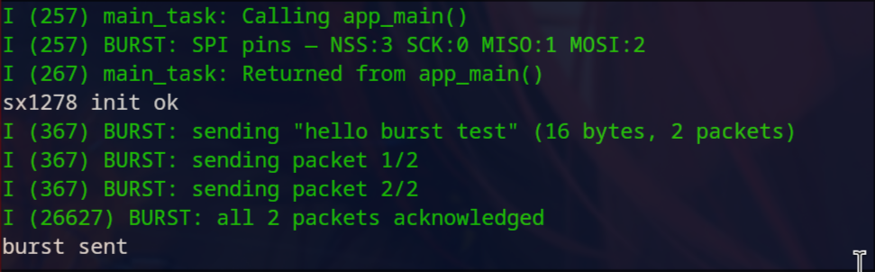
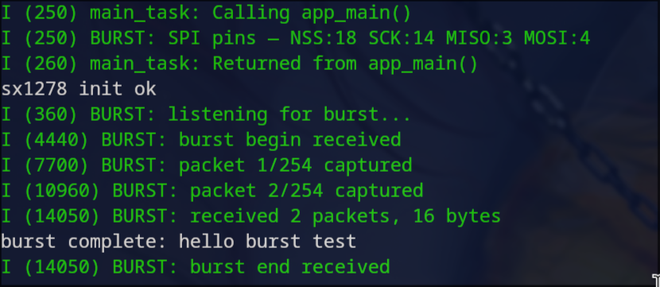

# Burst example

Sends a burst of packets from the ESP32-C3 (sender) to the ESP32-C6 (receiver) using
`send_burst` and `rx_packet_handler`. Each packet is acknowledged individually. The
receiver reassembles the data and prints it once the full burst is complete.

## Build and flash

```bash
# sender — ESP32-C3
rm sdkconfig && idf.py --preview set-target esp32c3 && idf.py build flash -p /dev/ttyACM0

# receiver — ESP32-C6
rm sdkconfig && idf.py --preview set-target esp32c6 && idf.py build flash -p /dev/ttyACM1
```

## Monitor

Open two terminals:

```bash
idf.py monitor -p /dev/ttyACM0   # sender (C3)
idf.py monitor -p /dev/ttyACM1   # receiver (C6)
```

### Sender output



### Receiver output



## Known limitations

- The ESP32-C6 native USB CDC interface does not support the RTS-based reset used by
  pytest-embedded, so automated testing is not available for the receiver side.
- The automated pytest suite (`pytest_burst.py`) is provided for reference but may fail
  to capture output from the C6.
