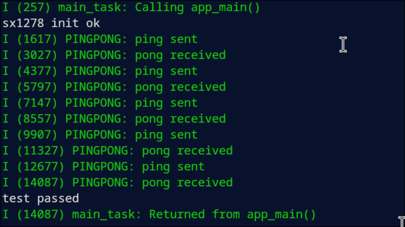

# Pingpong example

Sends "ping" from the ESP32-C3 (sender) and expects a "pong" back from the ESP32-C6 (receiver), repeated 5 times.

## Build and flash

```bash
# sender — ESP32-C3
idf.py --preview set-target esp32c3
idf.py build flash -p /dev/ttyACM0

# receiver — ESP32-C6 (delete sdkconfig first so IDF regenerates it)
rm sdkconfig
idf.py --preview set-target esp32c6
idf.py build flash -p /dev/ttyACM1
```

## Verify manually

Open two monitors and confirm the exchange:

```bash
idf.py monitor -p /dev/ttyACM0   # sender: prints "ping sent" / "pong received"
idf.py monitor -p /dev/ttyACM1   # receiver: prints "ping received" / "pong sent"
```

Both sides have been verified to work correctly via the serial monitor.



## Automated tests

The automated pytest suite has a known limitation with the ESP32-C6: its native USB CDC
interface does not support the RTS-based reset that pytest-embedded uses to reboot the
board after connecting. As a result, `pytest_pingpong.py` may fail to capture output on
the C6 side even though the firmware itself works correctly.

The init test (`pytest_sx1278_init.py`) targets the C3 only and runs without issues:

```bash
pytest pytest_sx1278_init.py --target esp32c3 --port /dev/ttyACM0
```
